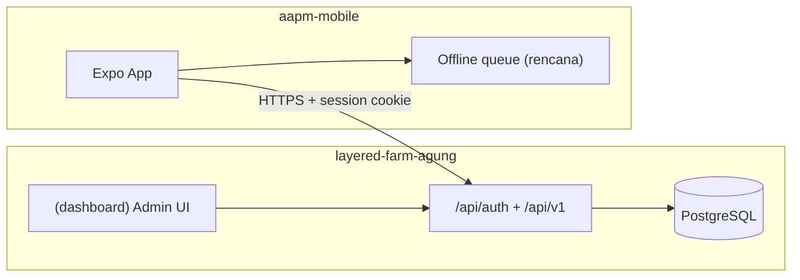

# Ekosistem AAPM — dua repositori

**Layered Farm Agung (AAPM)** dikembangkan sebagai **dua aplikasi terpisah** yang saling terhubung lewat API. Bukan monorepo tunggal; kontrak antar-repo dijaga lewat **OpenAPI** dan dokumentasi ini.

| | |
|--|--|
| **Terakhir diperbarui** | 2026-06-24 |
| **Pivot** | Mobile **PWA/Serwist di Next.js dihentikan** → **React Native + Expo** |

---

## 1. Ringkasan peran

| Repositori | Path lokal (relatif workspace) | Peran |
|------------|-------------------------------|--------|
| **layered-farm-agung** | `./` (repo ini) | **Admin dashboard** (desktop/web), **API backend**, database (Prisma/PostgreSQL), auth (Better Auth), MinIO |
| **aapm-mobile** | `../mobile-apps/aapm-mobile` | **Aplikasi lapangan** untuk **staff kandang** — input harian, QR, offline sync (rencana) |



---

## 2. Pembagian tanggung jawab

### Backend (`layered-farm-agung`) — **sumber kebenaran data**

| Area | Lokasi kode | Konsumen |
|------|-------------|----------|
| Master data (lokasi, kandang, strain, grade, vendor) | `features/*` + dashboard CRUD | Admin web |
| RBAC & tenant | `features/auth`, `features/permissions` | Admin + API |
| Operasional (produksi, pakan, populasi) | `features/production`, … + `app/api/v1/` | **Mobile** (+ rekap admin) |
| Skema & migrasi DB | `prisma/schema.prisma` | Hanya repo ini |
| Kontrak API mobile | `docs/apicontract/openapi.yaml` | Tim mobile |

**Jangan** menambah UI lapangan (`/kandang`, input harian) di Next.js. **Jangan** menduplikasi aturan bisnis di mobile — validasi utama tetap di server.

### Mobile (`aapm-mobile`) — **klien operasional**

| Area | Tanggung jawab |
|------|----------------|
| Login staff | Panggil Better Auth di backend |
| Daftar kandang, form produksi, scan QR | UI + state lokal |
| Offline / antrean sync | Klien (flush ke `/api/v1/*` saat online) |
| Brand & touch UX lapangan | Ikuti token dari `layered-farm-agung/DESIGN.md` (adaptasi RN) |

Peran **staff** (`staff.kandang`) ditujukan untuk mobile; admin/superadmin memakai dashboard web.

---

## 3. Alur integrasi API

1. Mobile memanggil `POST /api/auth/sign-in/username` pada backend.
2. Session cookie disimpan dan dikirim pada setiap `GET|POST /api/v1/*`.
3. Respons memakai envelope: `{ success, message, data }` atau `{ success: false, error }`.

Detail endpoint: **[apicontract/openapi.yaml](./apicontract/openapi.yaml)**.

| Endpoint v1 | Status |
|-------------|--------|
| `POST /api/v1/mobile/auth/sign-in` | ✅ |
| `GET /api/v1/cages` | ✅ |
| `GET /api/v1/cages/{cageId}` | ✅ |
| `POST /api/v1/cages/scan` | ✅ |
| `GET /api/v1/cages/{cageId}/daily-history` | ✅ |
| `GET /api/v1/egg-grades` | ✅ (legacy) |
| `POST /api/v1/production` | ✅ TB/TR/TP, multi-record; TB auto-menambah stok telur (IN_HARVEST) |
| `PATCH /api/v1/production/{recordId}` | ✅ rekonsiliasi stok telur saat TB berubah |
| `POST /api/v1/feed-consumption` | ✅ potong stok pakan (OUT_FEED) + peringatan stok rendah |
| `POST /api/v1/medical-records` | ✅ opsional potong stok obat/vitamin (OUT_MEDICAL) |
| `POST /api/v1/population-mutation` | ✅ |
| `GET /api/v1/items?type=…&cageId=…` | ✅ picker item + stok tersedia (Feed/Medicine/Vitamin) |
| `GET /api/v1/feed-items` | ✅ (legacy; gunakan `/items?type=Feed`) |

---

## 4. Pengembangan lokal (kedua repo)

### Urutan disarankan

```bash
# Terminal 1 — backend
cd layered-farm-agung
bun run docker:db    # Postgres host :5433
bun run dev          # http://localhost:3000

# Terminal 2 — mobile
cd mobile-apps/aapm-mobile
npm install
npx expo start
```

### URL API dari perangkat fisik

`localhost` di HP **tidak** mengarah ke laptop. Set `EXPO_PUBLIC_API_URL` di mobile ke IP LAN mesin dev, mis.:

```env
EXPO_PUBLIC_API_URL=http://192.168.1.10:3000
```

Backend: pastikan `BETTER_AUTH_URL` / `NEXT_PUBLIC_BETTER_AUTH_URL` konsisten dengan URL yang diakses mobile. CORS: `MOBILE_CORS_ORIGINS` di `.env` backend (lihat `.env.example`).

### Akun uji (seed)

| User | Password | Peran |
|------|----------|--------|
| `staff.kandang` | `password123` | Staff lapangan (mobile) |
| `admin.cabang` | `password123` | Admin tenant |
| `superadmin` | `password123` | Global |

---

## 5. Deep link & QR

- Skema Expo saat ini: `aapmmobile://` (`app.json` → `scheme`).
- Target bisnis (QR kandang): `…/kandang/{cageId}/produksi` — disepakati di tim mobile; selaraskan `scheme` + `expo-linking` saat implementasi scan.

Data kandang setelah scan: `GET /api/v1/cages/{cageId}`.

---

## 6. Aturan perubahan lintas repo

| Perubahan di backend | Tindakan di mobile |
|----------------------|-------------------|
| Endpoint baru / field baru | Update `openapi.yaml` + regenerate types / client |
| Validasi bisnis baru | Sesuaikan form UI; jangan skip error `400` dari API |
| Migrasi Prisma | Tidak ada migrasi di mobile — hanya adaptasi tipe respons |

| Perubahan di mobile | Tindakan di backend |
|---------------------|---------------------|
| Kebutuhan data baru | Tambah service + route `app/api/v1/` + OpenAPI |
| Flow offline baru | Backend tetap idempotent / terima `is_synced` bila perlu |

**PR rule:** perubahan API → update `docs/apicontract/openapi.yaml` dan baris terkait di `docs/sitemap.md` dalam PR yang sama.

---

## 7. Dokumen terkait

| Repo | Dokumen |
|------|---------|
| **layered-farm-agung** | [AGENTS.md](../AGENTS.md), [sitemap.md](./sitemap.md), [apicontract/](./apicontract/), [DEV_NOTES.md](../DEV_NOTES.md), [DESIGN.md](../DESIGN.md) |
| **aapm-mobile** | [docs/](../../mobile-apps/aapm-mobile/docs/) (progress & roadmap), [AGENTS.md](../../mobile-apps/aapm-mobile/AGENTS.md) |
