# Implementation Plan — AAPM Next Phase

**Living document** — checklist eksekusi agent untuk tahap pengerjaan AAPM (backend + mobile).

| | |
|--|--|
| **Terakhir diperbarui** | 2026-07-17 |
| **Status plan** | **Fase 5 ✅** · **Fase 6a ready ✅** · Fase 6b dashboard lite |
| **Progress domain (saat ini)** | D1 ~95% · D2 ~90% · D3 ~98% · D4 ~65% |
| **Overall (13 modul proposal)** | **~82%** |
| **Repo backend** | `layered-farm-agung` |
| **Repo mobile** | `aapm-mobile` |

**Referensi:** [sitemap.md](./sitemap.md) · [ecosystem.md](./ecosystem.md) · [prisma/schema.prisma](../prisma/schema.prisma) · [aapm-mobile/docs/progress.md](../../aapm-mobile/docs/progress.md)

---

## Ringkasan eksekusi

| Fase | Status | Ringkasan |
|------|--------|-----------|
| Baseline inventori | ✅ | Stok operasional + kartu stok + penyesuaian |
| Fase 1 — PO minimal | ✅ | Buat + terima → `IN_PURCHASE` |
| Fase 2 — Populasi ledger | ✅ | Populasi aktif + validasi mutasi |
| Fase 3 — KPI + HDP | ✅ | Dashboard stats + kolom HDP % |
| Fase 4 — Mobile riwayat | ✅ | Navigasi tanggal di riwayat kandang |
| Infra WIB (tanggal operasional) | ✅ | `lib/business-date.ts` — single source of truth |
| Fase 4b — Metrik siklus kandang | ✅ | Detail kandang: HDP, FCR, mutasi, riwayat enriched |
| **Fase 5 P1 — Offline sync** | ✅ | Write antrean + flush + warm cache + idempotency — [offline-sync-plan.md](../../aapm-mobile/docs/offline-sync-plan.md) |
| Fase 5 P2 — Mutasi stok global | ✅ | `/dashboard/inventory/mutations` |
| Fase 5 P3–P6 | ✅ | Vaksinasi, mutasi pindah, PO partial/cancel, finance + early warning |
| **Fase 6a — Ready** | ✅ | Neon migrate sales stock · smoke egg sales · docs sync · OpenAPI mobile types |
| **Fase 6b — Dashboard lite** | ✅ | FCR 7 hari · warning mortalitas · ringkas sales/kas minggu |

---

## Diagram dependensi

```mermaid
flowchart LR
  subgraph done [Selesai]
    Inv[Inventori]
    PO[PO_minimal]
    Pop[Populasi_ledger]
    KPI[Dashboard_KPI]
    MobHist[Mobile_riwayat]
    TZ[WIB_business_date]
    CageMet[Cage_cycle_metrics]
  end
  subgraph phase5 [Fase_5_aktif]
  Sync[Offline_sync_P1]
  InvMut[Mutasi_stok_global_P2]
  Vax[Vaksinasi_P3]
  end
  subgraph later [Nanti]
  Pindah[Mutasi_pindah_P4]
  POPenuh[PO_penuh_P5]
  D4[D4_Sales_Cashflow_P6]
  end
  done --> Sync
  Sync --> InvMut
  InvMut --> Vax
  Vax --> Pindah
  Pindah --> POPenuh
  POPenuh --> D4
```

**Urutan eksekusi berikutnya:** Offline sync hardening (P1b) → Mutasi stok global (P2) → Vaksinasi (P3) → Mutasi pindah (P4) → PO penuh (P5) → D4 (P6).

---

## Baseline — sudah selesai (jangan dikerjakan ulang)

- [x] Services inventori & stok (`apply-stock-mutation`, integrasi produksi/pakan/pengobatan)
- [x] Halaman `/dashboard/inventory` + detail item + kartu stok + penyesuaian stok
- [x] Mobile: form input harian 4 section (produksi, pakan, populasi, pengobatan) — POST langsung saat online
- [x] Input harian admin: grid status kandang + 4 tab rekap + kolom HDP %
- [x] Potong stok operasional: `OUT_FEED`, `OUT_MEDICAL`, `IN_HARVEST`

---

## Infra — Tanggal operasional WIB ✅

**Tujuan:** Semua “hari ini”, kalender, validasi tanggal, dan API `YYYY-MM-DD` konsisten di **Asia/Jakarta**.

- [x] `lib/business-timezone.ts` + `lib/business-date.ts` + test
- [x] `operationalBusinessDateSchema` — strict `YYYY-MM-DD`, blok tanggal masa depan
- [x] `validateOperationalBusinessDate()` di record services
- [x] `components/shared/record-date-picker.tsx` (Shadcn + WIB)
- [x] `aapm-mobile/lib/date.ts` — mirror WIB

### Konvensi (wajib untuk kode baru)

- **Wire format:** string `YYYY-MM-DD` di API/form
- **DB:** `@db.Date` di Prisma
- **JS encoding:** UTC midnight dengan Y-M-D yang sama (`2026-07-09T00:00:00.000Z`)
- **Jangan** pakai `toISOString().split("T")[0]` untuk tanggal operasional
- **Import:** `@/lib/business-date` (bukan `new Date()` mentah untuk “hari ini”)

---

## Fase 1–4 — Arsip singkat ✅

Detail lengkap tetap di Git history; ringkasan untuk konteks agent:

| Fase | Deliverable utama |
|------|-------------------|
| **1 PO** | `/dashboard/purchase-orders` — buat + terima → `IN_PURCHASE` |
| **2 Populasi** | `compute-cycle-population.ts` + validasi mutasi vs populasi aktif |
| **3 KPI** | `get-dashboard-stats.ts` + HDP % di rekap produksi admin |
| **4 Mobile riwayat** | `kandang/[id]/riwayat` — prev/next tanggal WIB |

---

## Fase 4b — Metrik siklus kandang (admin) ✅

**Selesai 2026-07-09** — enrich `/dashboard/cages/[id]` tanpa migrasi DB.

### Checklist

- [x] `features/cages/lib/cycle-operational-metrics.ts` — agregasi mutasi, produksi, FCR, HDP rata
- [x] `features/cages/services/get-cycle-operational-summary.ts` — batch query + `CycleOperationalSummary`
- [x] Extend `get-cage-detail.ts` — `summary` per siklus aktif & riwayat
- [x] `cage-detail-view.tsx` — kartu metrik siklus aktif + tabel riwayat enriched
- [x] Umur/tanggal WIB (`formatBusinessDateFromDb`, `computeCycleAgeParts`)
- [x] Riwayat siklus diurutkan `end_date` desc (terbaru ditutup di atas)
- [x] `cycle-operational-metrics.test.ts` — unit test helper murni
- [x] Update `docs/sitemap.md`

### DoD — tercapai

- [x] Populasi saat ini, HDP hari ini vs target, FCR, mutasi, kesehatan di siklus aktif
- [x] Riwayat closed: populasi akhir, Mati+Afkir, Total TB, HDP rata, FCR, durasi

### Backlog (bukan blocker)

- [ ] `RecordDatePicker` di dialog mulai siklus (polish WIB)
- [ ] Drill-down ke `/dashboard/production?date=` dari metrik siklus
- [ ] `VaccineSchedule` di panel kesehatan (gantung Modul 13)

---

## Fase 5 — Backlog aktif

### Prioritas roadmap

| Prioritas | Item | Repo | Modul proposal |
|-----------|------|------|----------------|
| **P1** | **Offline sync + idempotency** | keduanya | 5 (~15% → target ~70%) |
| P2 | Halaman mutasi stok global | backend | 8 |
| P3 | Vaksinasi | keduanya | 13 |
| P4 | Mutasi Pindah lintas kandang | backend | 6 (Fase 2b) |
| P5 | PO penuh (partial receive, edit, cancel) | backend | 7 |
| P6 | D4 Sales & Cashflow | backend | 11–12 |

---

## Fase 5 P1 — Offline sync + idempotency ✅

**Selesai 2026-07-14** — backend `client_mutation_id` + mobile outbox/flush/warm cache/picker. Detail: **[aapm-mobile/docs/offline-sync-plan.md](../../aapm-mobile/docs/offline-sync-plan.md)**. Edit/PATCH offline & admin `SyncQueue` monitor tetap out of scope.

### DoD — tercapai

- [x] Mode pesawat: submit → antrean lokal
- [x] Online: flush otomatis/manual → data di admin & riwayat
- [x] Idempotent `clientMutationId`
- [x] Profil antrean + badge tab
- [x] OpenAPI field idempotency

---

## Staging infra ✅

- Vercel (Hobby) + Neon Postgres + Cloudflare R2 — lihat [staging.md](./staging.md)
- Lokal tetap Docker Postgres + MinIO via `.env`

---

## Fase 5 P2 — Mutasi stok global ✅

**Selesai 2026-07-14.** `/dashboard/inventory/mutations`

- [x] `list-stock-mutations.ts` + toolbar + table
- [x] Nav `manage_inventory` + filter URL + pagination

---

## Fase 5 P3 — Vaksinasi (Modul 13) ✅

**Tujuan:** Jadwal vaksin per kandang + item `Vaccine`; selesaikan di lapangan; potong stok `OUT_VACCINE`.

### Checklist

- [x] CRUD `VaccineSchedule` admin (`/dashboard/health/vaccines`)
- [x] API: GET jadwal cage + POST complete
- [x] Service `complete-vaccination.ts` → `OUT_VACCINE`
- [x] Form vaksin di mobile
- [x] OpenAPI + sitemap

---

## Fase 5 P4 — Mutasi Pindah lintas kandang ✅

- [x] Migrasi `target_cage_id` di `PopulationMutation`
- [x] Service transfer atomik + API + test Category A

---

## Fase 5 P5 — PO penuh ✅

- [x] Partial receive per line
- [x] Cancel PO Pending
- [ ] Hook Paid PO → cashflow (opsional, belum)

---

## Fase 5 P6 — D4 Sales & Cashflow ✅

- [x] Customer + SalesOrder CRUD admin
- [x] Cashflow / Opex di `/dashboard/finance`
- [x] Early warning sederhana vs ProductionTarget (dashboard)

---

## Konvensi eksekusi agent

1. Ikuti pola `features/vendors/` untuk CRUD admin baru
2. Stok selalu lewat `apply-stock-mutation.ts` dalam `$transaction`
3. Tanggal operasional lewat `@/lib/business-date` (WIB)
4. Pesan error Bahasa Indonesia
5. Test Category A untuk stock/populasi/idempotency (Bun, colocated)
6. Perubahan API → update `openapi.yaml`
7. Update `sitemap.md` per fase
8. Jangan commit kecuali user minta

---

## Fase 6a — Production readiness ✅

- [x] Neon `db:migrate:deploy` (sales `location_id` / grade opsional)
- [x] Smoke checklist jual telur — [`smoke-egg-sales.md`](./smoke-egg-sales.md) + unit tests Category A
- [x] Sync `sitemap.md` / progress domain D4
- [x] Mobile OpenAPI types: `aapm-mobile/types/aapm-api.ts`

## Fase 6b — Dashboard lite (Modul 9–10) ✅

- [x] FCR ringkas (hari ini + 7 hari) di `get-dashboard-stats`
- [x] Early warning mortalitas (`Mati` 7 hari)
- [x] Ringkas penjualan + saldo kas minggu ini
- [x] Pertahankan HDP warning yang sudah ada

## Sesi agent — quick start

**Selesai Fase 6a/6b.** Backlog opsional: PATCH offline, SyncQueue monitor, PO→cashflow auto, Delivery_Logs, portal buyer.
