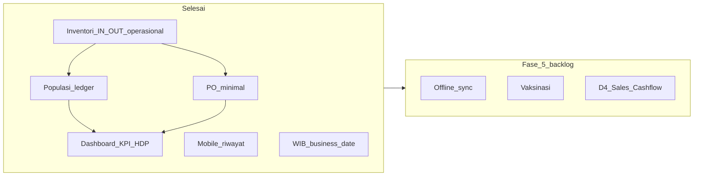

# Implementation Plan — AAPM Next Phase

**Living document** — checklist eksekusi agent untuk tahap pengerjaan setelah integrasi inventori (2–3 Juli 2026).

| | |
|--|--|
| **Terakhir diperbarui** | 2026-07-09 |
| **Status plan** | **Fase 1–4 selesai** · Fase 5 = target berikutnya |
| **Progress domain (saat ini)** | D1 ~95% · D2 ~85% · D3 ~90% · D4 ~5% |
| **Overall (13 modul proposal)** | **~56%** |
| **Repo backend** | `layered-farm-agung` |
| **Repo mobile** | `aapm-mobile` |

**Referensi:** [sitemap.md](./sitemap.md) · [weekly progress/02-07-2026.md](./weekly%20progress/02-07-2026.md) · [prisma/schema.prisma](../prisma/schema.prisma)

---

## Ringkasan eksekusi

| Fase | Status | Ringkasan |
|------|--------|-----------|
| Baseline inventori | ✅ | Stok operasional + kartu stok + penyesuaian |
| Fase 1 — PO minimal | ✅ | Buat + terima → `IN_PURCHASE` |
| Fase 2 — Populasi ledger | ✅ | Populasi aktif + validasi mutasi |
| Fase 3 — KPI + HDP | ✅ | Dashboard stats + kolom HDP % |
| Fase 4 — Mobile riwayat | ✅ | Navigasi tanggal di riwayat kandang |
| Infra WIB (tanggal operasional) | ✅ | `lib/business-timezone.ts` + `lib/business-date.ts` |
| Fase 5 — Backlog | 🔲 | Lihat § Fase 5 |

---

## Baseline — sudah selesai (jangan dikerjakan ulang)

- [x] Services inventori & stok (`apply-stock-mutation`, integrasi produksi/pakan/pengobatan)
- [x] Halaman `/dashboard/inventory` + detail item
- [x] **Penyesuaian stok** manual per lokasi (`IN_ADJUSTMENT` / `OUT_ADJUSTMENT`)
- [x] **Kartu stok** per item (riwayat mutasi di halaman detail)
- [x] Mobile: form input harian pakai item nyata dari `/api/v1/items`
- [x] Potong stok operasional: `OUT_FEED`, `OUT_MEDICAL`, `IN_HARVEST`
- [x] Input harian admin: grid status kandang + 4 tab rekap (data nyata)

---

## Infra — Tanggal operasional WIB (selesai 2026-07-09)

**Tujuan:** Semua “hari ini”, kalender, validasi tanggal, dan API `YYYY-MM-DD` konsisten di **Asia/Jakarta** — tidak bergantung timezone server/browser.

### Checklist

- [x] `lib/business-timezone.ts` — `BUSINESS_TIMEZONE`, `getBusinessCalendarParts`
- [x] `lib/business-date.ts` — single source of truth (parse, format, today, shift, Zod schema)
- [x] `lib/business-date.test.ts` — boundary WIB + strict schema
- [x] Re-export `features/production/lib/parse-production-date.ts` (backward compat)
- [x] Konsolidasi `normalizeBusinessDate` — hapus duplikat di services
- [x] `operationalBusinessDateSchema` — strict `YYYY-MM-DD`, blok tanggal masa depan
- [x] Validasi service-layer `validateOperationalBusinessDate()` di record services
- [x] Perbaikan `cage-detail-view`, cycle schema, procurement read path
- [x] `components/shared/record-date-picker.tsx` — Shadcn + WIB
- [x] `aapm-mobile/lib/date.ts` — mirror WIB + `formatRecordDateLabel`

### Konvensi (wajib untuk kode baru)

- **Wire format:** string `YYYY-MM-DD` di API/form
- **DB:** `@db.Date` di Prisma
- **JS encoding:** UTC midnight dengan Y-M-D yang sama (`2026-07-09T00:00:00.000Z`)
- **Jangan** pakai `toISOString().split("T")[0]` untuk tanggal operasional
- **Import:** `@/lib/business-date` (bukan `new Date()` mentah untuk “hari ini”)

---

## Diagram dependensi fase



**Urutan eksekusi berikutnya (Fase 5):** Offline sync → Mutasi stok global → Vaksinasi → PO penuh / Mutasi pindah → D4.

---

## Fase 1 — Purchase Order minimal (Modul 7, D2) ✅

**Tujuan:** Admin catat pembelian ke supplier; stok naik via `IN_PURCHASE`.

### Checklist

- [x] `features/procurement/schemas/purchase-order.ts` — Zod validasi
- [x] `features/procurement/services/create-purchase-order.ts`
- [x] `features/procurement/services/receive-purchase-order.ts` — `applyStockMutation` + `IN_PURCHASE`
- [x] `features/procurement/services/list-purchase-orders.ts`
- [x] `features/procurement/services/get-purchase-order.ts`
- [x] `features/procurement/actions/create-purchase-order.ts`
- [x] `features/procurement/actions/receive-purchase-order.ts`
- [x] `features/procurement/components/purchase-orders-management.tsx`
- [x] `features/procurement/components/purchase-order-detail-view.tsx`
- [x] `features/procurement/components/receive-purchase-order-dialog.tsx`
- [x] `app/(dashboard)/dashboard/purchase-orders/page.tsx`
- [x] `app/(dashboard)/dashboard/purchase-orders/[poId]/page.tsx`
- [x] Nav item di `features/dashboard/config/navigation.ts` — permission `manage_inventory`
- [x] `features/procurement/schemas/purchase-order.test.ts`
- [x] UI polish: date picker Shadcn, pagination, scroll barang, Terima di tabel
- [x] Update `docs/sitemap.md`

### DoD — tercapai

- [x] Admin buat PO (vendor + line items); lokasi penerimaan saat **Terima barang**
- [x] Tombol "Terima barang" → stok bertambah; kartu stok menampilkan "Pembelian"
- [x] `purchaseOrderCount` di daftar vendor terisi dari `_count.purchase_orders`

### Out of scope (Fase 5)

- Partial receive, edit/cancel PO, integrasi cashflow D4

---

## Fase 2 — Populasi ledger (D2+D3) ✅

### Rumus (siklus aktif, sampai `asOfDate`)

```
current = initial_population + sum(Masuk) - sum(Mati) - sum(Afkir) - sum(Pindah)
```

### Checklist

- [x] `features/cages/lib/compute-cycle-population.ts`
- [x] `features/cages/lib/compute-cycle-population.test.ts`
- [x] Wire `get-cage-for-production.ts`, `list-field-cages.ts`
- [x] Validasi `record-population-mutation.ts` + `update-population-mutation.ts`
- [x] Update `docs/sitemap.md`

### DoD — tercapai

- [x] API mobile return populasi aktif (bukan initial saja)
- [x] Mati/Afkir/Pindah ditolak jika melebihi populasi aktif
- [x] Unit test ledger lulus

### Backlog Fase 2b (belum)

- [ ] Mutasi `Pindah` antar kandang — butuh `target_cage_id` di schema (migrasi terpisah)

---

## Fase 3 — Dashboard KPI + HDP rekap (Modul 10 awal) ✅

### Checklist

- [x] `features/dashboard/services/get-dashboard-stats.ts`
- [x] Wire `features/dashboard/components/dashboard-overview.tsx`
- [x] `features/production/lib/compute-hdp.ts` + test
- [x] `features/cages/lib/cycle-age-weeks.ts`
- [x] Extend `list-daily-production-recap.ts` + `daily-production-recap-table.tsx` — kolom HDP %
- [x] Update `docs/sitemap.md`

### DoD — tercapai

- [x] `/dashboard` menampilkan produksi hari ini, populasi aktif, stok kritis, pengguna aktif
- [x] Rekap telur admin punya kolom HDP %

### Out of scope

- Early warning push, FCR penuh, portal buyer

---

## Fase 4 — Mobile riwayat multi-tanggal (`aapm-mobile`) ✅

### Checklist

- [x] `app/kandang/[id]/riwayat.tsx` — navigasi tanggal (prev/next + ke hari ini)
- [x] `aapm-mobile/lib/date.ts` — WIB `todayRecordDate()`
- [x] Update `aapm-mobile/docs/progress.md`

### DoD — tercapai

- [x] Staff bisa lihat riwayat kandang untuk tanggal selain hari ini

---

## Fase 5 — Backlog (target berikutnya)

**Prioritas disarankan** untuk eksekusi agent berikutnya:

| Prioritas | Item | Catatan |
|-----------|------|---------|
| P1 | Offline sync + idempotency | Mobile `pending-input-queue` flush + `clientMutationId` di API |
| P2 | Halaman mutasi stok global | `/dashboard/inventory/mutations` |
| P3 | Vaksinasi Modul 13 | `VaccineSchedule` + `OUT_VACCINE` + UI mobile/admin |
| P4 | Mutasi Pindah lintas kandang | Fase 2b — migrasi `target_cage_id` |
| P5 | PO penuh | partial receive, edit, cancel |
| P6 | D4 Sales & Cashflow | setelah operasional stabil |

---

## Konvensi eksekusi agent

1. Ikuti pola `features/vendors/` untuk CRUD admin baru
2. Stok selalu lewat `apply-stock-mutation.ts` dalam `$transaction`
3. Tanggal operasional selalu lewat `@/lib/business-date` (WIB)
4. Pesan error Bahasa Indonesia
5. Test Category A untuk stock math, populasi ledger, & business date (Bun, colocated `.test.ts`)
6. Update `sitemap.md` per fase (+ OpenAPI hanya jika endpoint mobile baru)
7. Jangan commit kecuali user minta

---

## Perkiraan dampak progress

| Milestone | D2 | D3 | D4 | Overall (13 modul) |
|-----------|----|----|-----|---------------------|
| Baseline (Jul 2–3) | ~70% | ~75% | ~5% | ~43% |
| Fase 1 (PO) | ~80% | ~78% | ~5% | ~48% |
| Fase 2 (populasi) | ~85% | ~82% | ~5% | ~52% |
| Fase 3 (KPI+HDP) | ~85% | ~88% | ~8% | ~55% |
| Fase 4 (mobile riwayat) | ~85% | ~90% | ~5% | ~56% |
| + Infra WIB (9 Jul) | ~85% | ~90% | ~5% | ~56%* |

\*Overall naik perlahan karena Fase 5 (sync, vaksin, D4) belum menyentuh modul 5/9/11/12.

### Modul proposal (perkiraan 2026-07-09)

| # | Modul | % |
|---|--------|---|
| 1 | User management | ~95% |
| 2 | Master data peternakan | ~80% |
| 3 | Strain & standardisasi | ~65% |
| 4 | Front office input | ~85% |
| 5 | Offline sync | ~15% |
| 6 | Mutasi populasi | ~70% |
| 7 | Vendor & procurement | ~75% |
| 8 | Inventory | ~75% |
| 9 | Early warning | ~0% |
| 10 | Executive dashboard | ~40% |
| 11 | Sales | ~0% |
| 12 | Cashflow | ~0% |
| 13 | Health / vaccination | ~25% |

---

*Perbarui dokumen ini setelah menyelesaikan item Fase 5 atau milestone besar.*
