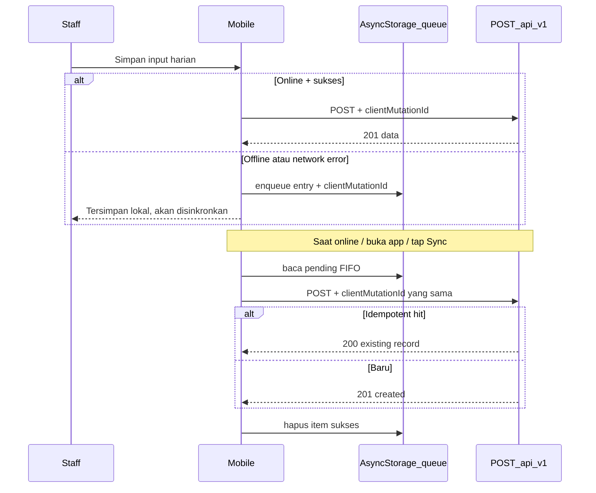

# Implementation Plan — AAPM Next Phase

**Living document** — checklist eksekusi agent untuk tahap pengerjaan AAPM (backend + mobile).

| | |
|--|--|
| **Terakhir diperbarui** | 2026-07-09 |
| **Status plan** | **Fase 5 P1 partial** (write antrean ✅) · **P1b hardening** → [offline-sync-plan.md](../../aapm-mobile/docs/offline-sync-plan.md) · **P2 mutasi stok = berikutnya** |
| **Progress domain (saat ini)** | D1 ~95% · D2 ~88% · D3 ~95% · D4 ~5% |
| **Overall (13 modul proposal)** | **~65%** |
| **Repo backend** | `layered-farm-agung` |
| **Repo mobile** | `aapm-mobile` |

**Referensi:** [sitemap.md](./sitemap.md) · [ecosystem.md](./ecosystem.md) · [prisma/schema.prisma](../prisma/schema.prisma) · [aapm-mobile/docs/progress.md](../../aapm-mobile/docs/progress.md)

---

## Ringkasan eksekusi

| Fase | Status | Ringkasan |
|------|--------|-----------|
| Baseline inventori | ✅ | Stok operasional + kartu stok + penyesuaian |
| Fase 1 — PO minimal | ✅ | Buat + terima → `IN_PURCHASE` |
| Fase 2 — Populasi ledger | ✅ | Populasi aktif + validasi mutasi |
| Fase 3 — KPI + HDP | ✅ | Dashboard stats + kolom HDP % |
| Fase 4 — Mobile riwayat | ✅ | Navigasi tanggal di riwayat kandang |
| Infra WIB (tanggal operasional) | ✅ | `lib/business-date.ts` — single source of truth |
| Fase 4b — Metrik siklus kandang | ✅ | Detail kandang: HDP, FCR, mutasi, riwayat enriched |
| **Fase 5 P1 — Offline sync** | 🟡 | Write antrean ✅ · read cache + UX + reliabilitas → [offline-sync-plan.md](../../aapm-mobile/docs/offline-sync-plan.md) |
| Fase 5 P2–P6 | 🔲 | Lihat § Fase 5 |

---

## Diagram dependensi

```mermaid
flowchart LR
  subgraph done [Selesai]
    Inv[Inventori]
    PO[PO_minimal]
    Pop[Populasi_ledger]
    KPI[Dashboard_KPI]
    MobHist[Mobile_riwayat]
    TZ[WIB_business_date]
    CageMet[Cage_cycle_metrics]
  end
  subgraph phase5 [Fase_5_aktif]
  Sync[Offline_sync_P1]
  InvMut[Mutasi_stok_global_P2]
  Vax[Vaksinasi_P3]
  end
  subgraph later [Nanti]
  Pindah[Mutasi_pindah_P4]
  POPenuh[PO_penuh_P5]
  D4[D4_Sales_Cashflow_P6]
  end
  done --> Sync
  Sync --> InvMut
  InvMut --> Vax
  Vax --> Pindah
  Pindah --> POPenuh
  POPenuh --> D4
```



**Urutan eksekusi berikutnya:** Offline sync hardening (P1b) → Mutasi stok global (P2) → Vaksinasi (P3) → Mutasi pindah (P4) → PO penuh (P5) → D4 (P6).

---

## Baseline — sudah selesai (jangan dikerjakan ulang)

- [x] Services inventori & stok (`apply-stock-mutation`, integrasi produksi/pakan/pengobatan)
- [x] Halaman `/dashboard/inventory` + detail item + kartu stok + penyesuaian stok
- [x] Mobile: form input harian 4 section (produksi, pakan, populasi, pengobatan) — POST langsung saat online
- [x] Input harian admin: grid status kandang + 4 tab rekap + kolom HDP %
- [x] Potong stok operasional: `OUT_FEED`, `OUT_MEDICAL`, `IN_HARVEST`

---

## Infra — Tanggal operasional WIB ✅

**Tujuan:** Semua “hari ini”, kalender, validasi tanggal, dan API `YYYY-MM-DD` konsisten di **Asia/Jakarta**.

- [x] `lib/business-timezone.ts` + `lib/business-date.ts` + test
- [x] `operationalBusinessDateSchema` — strict `YYYY-MM-DD`, blok tanggal masa depan
- [x] `validateOperationalBusinessDate()` di record services
- [x] `components/shared/record-date-picker.tsx` (Shadcn + WIB)
- [x] `aapm-mobile/lib/date.ts` — mirror WIB

### Konvensi (wajib untuk kode baru)

- **Wire format:** string `YYYY-MM-DD` di API/form
- **DB:** `@db.Date` di Prisma
- **JS encoding:** UTC midnight dengan Y-M-D yang sama (`2026-07-09T00:00:00.000Z`)
- **Jangan** pakai `toISOString().split("T")[0]` untuk tanggal operasional
- **Import:** `@/lib/business-date` (bukan `new Date()` mentah untuk “hari ini”)

---

## Fase 1–4 — Arsip singkat ✅

Detail lengkap tetap di Git history; ringkasan untuk konteks agent:

| Fase | Deliverable utama |
|------|-------------------|
| **1 PO** | `/dashboard/purchase-orders` — buat + terima → `IN_PURCHASE` |
| **2 Populasi** | `compute-cycle-population.ts` + validasi mutasi vs populasi aktif |
| **3 KPI** | `get-dashboard-stats.ts` + HDP % di rekap produksi admin |
| **4 Mobile riwayat** | `kandang/[id]/riwayat` — prev/next tanggal WIB |

---

## Fase 4b — Metrik siklus kandang (admin) ✅

**Selesai 2026-07-09** — enrich `/dashboard/cages/[id]` tanpa migrasi DB.

### Checklist

- [x] `features/cages/lib/cycle-operational-metrics.ts` — agregasi mutasi, produksi, FCR, HDP rata
- [x] `features/cages/services/get-cycle-operational-summary.ts` — batch query + `CycleOperationalSummary`
- [x] Extend `get-cage-detail.ts` — `summary` per siklus aktif & riwayat
- [x] `cage-detail-view.tsx` — kartu metrik siklus aktif + tabel riwayat enriched
- [x] Umur/tanggal WIB (`formatBusinessDateFromDb`, `computeCycleAgeParts`)
- [x] Riwayat siklus diurutkan `end_date` desc (terbaru ditutup di atas)
- [x] `cycle-operational-metrics.test.ts` — unit test helper murni
- [x] Update `docs/sitemap.md`

### DoD — tercapai

- [x] Populasi saat ini, HDP hari ini vs target, FCR, mutasi, kesehatan di siklus aktif
- [x] Riwayat closed: populasi akhir, Mati+Afkir, Total TB, HDP rata, FCR, durasi

### Backlog (bukan blocker)

- [ ] `RecordDatePicker` di dialog mulai siklus (polish WIB)
- [ ] Drill-down ke `/dashboard/production?date=` dari metrik siklus
- [ ] `VaccineSchedule` di panel kesehatan (gantung Modul 13)

---

## Fase 5 — Backlog aktif

### Prioritas roadmap

| Prioritas | Item | Repo | Modul proposal |
|-----------|------|------|----------------|
| **P1** | **Offline sync + idempotency** | keduanya | 5 (~15% → target ~70%) |
| P2 | Halaman mutasi stok global | backend | 8 |
| P3 | Vaksinasi | keduanya | 13 |
| P4 | Mutasi Pindah lintas kandang | backend | 6 (Fase 2b) |
| P5 | PO penuh (partial receive, edit, cancel) | backend | 7 |
| P6 | D4 Sales & Cashflow | backend | 11–12 |

---

## Fase 5 P1 — Offline sync + idempotency 🟡

**Partial 2026-07-09** — write antrean + idempotency backend selesai; reliabilitas flush, bootstrap cache, UX picker belum. Detail: **[aapm-mobile/docs/offline-sync-plan.md](../../aapm-mobile/docs/offline-sync-plan.md)**.

**Tujuan:** Staff kandang bisa menyimpan input harian saat **offline**; antrean lokal di-flush otomatis/manual saat online. Server **idempotent** — submit ulang tidak duplikasi data.

**Konteks saat ini:**

| Lapisan | Sudah ada | Belum |
|---------|-----------|-------|
| Mobile | `features/daily-input/lib/pending-input-queue.ts` (enqueue + list) | flush, remove, UI sync, fallback saat gagal jaringan |
| Mobile | `submit-daily-input.ts` — POST langsung | enqueue on network error |
| Mobile | Placeholder profil “sync belum aktif” | badge antrean + retry manual |
| Backend | `is_synced` di model operasional | `clientMutationId` + dedup |
| Backend | Model `SyncQueue` di Prisma | API + service (opsional fase ini) |
| Kontrak | OpenAPI v1 core | field idempotency |

### Arsitektur yang disepakati



**Keputusan desain (agent wajib ikuti):**

1. **`clientMutationId`** — UUID v4, dikirim di body setiap POST operasional; disimpan unik per tabel (atau lookup composite `tenant + cage + clientMutationId`).
2. **Idempotency** — jika `clientMutationId` sudah ada → return record existing (HTTP 200), jangan buat duplikat stok/populasi.
3. **Antrean mobile** — satu entry = satu operasi atomik (bukan satu form gabungan); pecah form unified menjadi beberapa queue item saat offline.
4. **`is_synced`** — set `false` saat record dibuat dari sync flush; `true` untuk POST langsung online (backward compat).
5. **`SyncQueue` server** — **opsional P1**; prioritaskan idempotent POST dulu. Admin monitoring antrean server → P2 atau sub-task P1b.

### 5.1 Backend — idempotency

#### Checklist schema & migrasi

- [ ] Tambah kolom `client_mutation_id String? @unique` (atau `@@unique([tenant_id, client_mutation_id])`) ke:
  - `DailyProduction`
  - `FeedConsumption`
  - `PopulationMutation`
  - `MedicalRecord`
- [ ] `bun run db:migrate` — migrasi terpisah, nama deskriptif

#### Checklist services (Category A — wajib test)

- [ ] Helper `findExistingByClientMutationId(table, tenantId, id)` di `features/production/lib/` atau `lib/api/`
- [ ] Update `record-daily-production.ts` — terima `clientMutationId?`; short-circuit jika sudah ada
- [ ] Update `record-feed-consumption.ts` — sama + stok tidak double-deduct
- [ ] Update `record-population-mutation.ts` — sama
- [ ] Update `record-medical-record.ts` — sama
- [ ] Set `is_synced: false` bila datang dari client dengan `clientMutationId` (atau flag eksplisit `fromSync`)
- [ ] Colocated tests: duplicate `clientMutationId` → satu record, stok sekali

#### Checklist API routes

- [ ] Extend Zod schema POST di `features/production/schemas/` (+ feed, population, medical)
- [ ] Wire `app/api/v1/production/route.ts` (+ feed-consumption, population-mutation, medical-records)
- [ ] Response idempotent: `{ success: true, data: { ...existing }, message: "..." }` — HTTP 200 vs 201 konsisten
- [ ] Update `docs/apicontract/openapi.yaml`
- [ ] Regenerate types mobile: `npx openapi-typescript ... -o aapm-mobile/types/aapm-api.ts`

### 5.2 Mobile — antrean & flush

#### Checklist queue engine

- [ ] Extend `pending-input-queue.ts`:
  - [ ] `removePendingDailyInput(id)`
  - [ ] `updatePendingStatus(id, status: pending | failed | syncing)`
  - [ ] Type per operasi: `production | feed | population | medical` (satu item = satu POST)
  - [ ] Field `clientMutationId` (UUID) per entry
- [ ] `features/sync/lib/flush-pending-queue.ts` — iterasi FIFO, panggil API, hapus jika sukses
- [ ] Deteksi koneksi: `@react-native-community/netinfo` (atau Expo equivalent)
- [ ] Trigger flush: app foreground, NetInfo `isConnected`, setelah login sukses

#### Checklist submit flow

- [ ] Refactor `submit-daily-input.ts`:
  - [ ] Coba POST online dengan `clientMutationId`
  - [ ] Pada `ApiRequestError` network / 5xx / timeout → enqueue, jangan hilangkan data user
  - [ ] Pesan UI: “Tersimpan lokal” vs “Tersimpan ke server”
- [ ] Edit forms (`edit-*-form.tsx`) — **out of scope P1** kecuali user minta; fokus create dulu

#### Checklist UI

- [ ] `app/(tabs)/profile.tsx` — daftar antrean, jumlah pending, tombol “Sinkronkan sekarang”
- [ ] Badge/indikator di tab Profil atau header jika `pendingCount > 0`
- [ ] Toast Bahasa Indonesia untuk hasil flush (sukses N, gagal M)

#### Checklist mobile docs

- [ ] Update `aapm-mobile/docs/progress.md`
- [ ] Update `aapm-mobile/docs/roadmap-domain3.md` — tandai Fase 4 partial

### DoD — Fase 5 P1

- [ ] Mode pesawat: submit produksi + pakan → masuk antrean lokal, form kosong, pesan jelas
- [ ] Online kembali: flush otomatis atau manual → data muncul di admin rekap & riwayat mobile
- [ ] Submit ulang item yang sama (`clientMutationId` identik) → tidak duplikat TB/stok/populasi
- [ ] Profil menampilkan jumlah antrean + retry
- [ ] OpenAPI + test idempotency lulus
- [ ] Update `docs/sitemap.md`

### Out of scope P1

- Edit/update record offline (PATCH antrean)
- Conflict resolution UI (server wins; tampilkan error jika validasi gagal permanen)
- Admin halaman monitoring `SyncQueue` server
- Background sync saat app killed (cukup foreground + manual retry)

### Risiko & mitigasi

| Risiko | Mitigasi |
|--------|----------|
| Form unified → banyak queue item, sebagian gagal | Flush per item; laporkan partial success di UI |
| Stok habis saat flush terlambat | Server tolak dengan error jelas; item tetap `failed` di antrean |
| `clientMutationId` collision | UUID v4; unique constraint DB |
| Populasi berubah antara enqueue & flush | Validasi server tetap jalan; staff lihat error + retry/edit |

---

## Fase 5 P2 — Mutasi stok global 🔲

**Tujuan:** Admin lihat semua mutasi stok lintas item/lokasi tanpa buka detail item satu per satu.

### Checklist

- [ ] `features/inventory/services/list-stock-mutations.ts` — filter tanggal, lokasi, item, tipe
- [ ] `features/inventory/components/stock-mutations-table.tsx` + toolbar (search, filter)
- [ ] `app/(dashboard)/dashboard/inventory/mutations/page.tsx`
- [ ] Nav item di `navigation.ts` — permission `manage_inventory`
- [ ] Update `docs/sitemap.md`

### DoD

- [ ] Tabel menampilkan: tanggal, item, lokasi, tipe (`IN_PURCHASE`, `OUT_FEED`, dll.), qty, referensi
- [ ] Pagination + filter URL (`?q=`, `?type=`, `?from=&to=`)

---

## Fase 5 P3 — Vaksinasi (Modul 13) 🔲

**Tujuan:** Jadwal vaksin per strain/umur; input lapangan; potong stok `OUT_VACCINE`.

### Checklist (high level)

- [ ] CRUD `VaccineSchedule` admin (`/dashboard/health/vaccines` atau di strain)
- [ ] API mobile: GET jadwal + POST pencatatan vaksin
- [ ] Service `record-vaccination.ts` → `applyStockMutation` `OUT_VACCINE`
- [ ] Form vaksin di mobile (section baru atau tab terpisah)
- [ ] Integrasi panel kesehatan di detail kandang (opsional)
- [ ] OpenAPI + `docs/sitemap.md`

---

## Fase 5 P4 — Mutasi Pindah lintas kandang (Fase 2b) 🔲

**Butuh migrasi:** `target_cage_id` di `PopulationMutation`.

- [ ] Prisma migrate + validasi tenant scope
- [ ] Service: kurangi sumber, tambah target (satu transaksi)
- [ ] API mobile + admin rekap
- [ ] Test Category A — populasi kedua kandang

---

## Fase 5 P5 — PO penuh 🔲

- [ ] Partial receive per line item
- [ ] Edit PO draft / cancel
- [ ] (Opsional) hook ke cashflow D4

---

## Fase 5 P6 — D4 Sales & Cashflow 🔲

- [ ] `Customer`, `SalesOrder`, `CashflowTransaction` — CRUD admin
- [ ] `/dashboard/finance` dari placeholder → fungsional
- [ ] Mobile: **tidak** — Domain 4 admin only

---

## Konvensi eksekusi agent

1. Ikuti pola `features/vendors/` untuk CRUD admin baru
2. Stok selalu lewat `apply-stock-mutation.ts` dalam `$transaction`
3. Tanggal operasional selalu lewat `@/lib/business-date` (WIB)
4. Pesan error Bahasa Indonesia
5. Test Category A untuk stock math, populasi ledger, idempotency, & business date (Bun, colocated `.test.ts`)
6. Perubahan API mobile → update `openapi.yaml` + types di `aapm-mobile` dalam task yang sama
7. Update `sitemap.md` per fase/sub-fase
8. Jangan commit kecuali user minta

---

## Perkiraan dampak progress

| Milestone | D2 | D3 | D4 | Overall (13 modul) |
|-----------|----|----|-----|---------------------|
| Fase 4 + WIB (9 Jul) | ~85% | ~90% | ~5% | ~56% |
| **+ Fase 4b metrik siklus** | **~88%** | **~92%** | **~5%** | **~58%** |
| Target + P1 offline sync | ~88% | ~95% | ~5% | ~65% |
| Target + P2 mutasi global | ~90% | ~95% | ~5% | ~67% |
| Target + P3 vaksinasi | ~90% | ~98% | ~5% | ~72% |

### Modul proposal (perkiraan 2026-07-09)

| # | Modul | % | Catatan |
|---|--------|---|---------|
| 1 | User management | ~95% | |
| 2 | Master data peternakan | ~88% | + metrik siklus detail kandang |
| 3 | Strain & standardisasi | ~65% | |
| 4 | Front office input | ~85% | mobile form lengkap |
| 5 | Offline sync | ~15% | **P1 aktif** — antrean ada, flush belum |
| 6 | Mutasi populasi | ~75% | ledger + validasi; pindah lintas kandang 🔲 |
| 7 | Vendor & procurement | ~75% | PO minimal ✅ |
| 8 | Inventory | ~78% | mutasi global 🔲 |
| 9 | Early warning | ~0% | setelah KPI/FCR stabil |
| 10 | Executive dashboard | ~45% | KPI dasar + HDP; FCR per kandang ✅ |
| 11 | Sales | ~0% | D4 |
| 12 | Cashflow | ~0% | D4 |
| 13 | Health / vaccination | ~25% | pengobatan ✅; vaksin 🔲 |

---

## Sesi agent berikutnya — quick start

```bash
# 1. Backend: migrasi client_mutation_id
cd layered-farm-agung
bun run db:migrate

# 2. Implement idempotent record services + tests
bun test features/production/services/

# 3. Mobile: extend queue + flush
cd ../aapm-mobile
npm install @react-native-community/netinfo  # jika belum ada

# 4. Verifikasi manual: mode pesawat → submit → online → flush
```

**Mulai dari:** § Fase 5 P1 — Backend idempotency, lalu mobile flush.

---

*Perbarui dokumen ini setelah menyelesaikan sub-fase Fase 5 atau milestone besar.*
