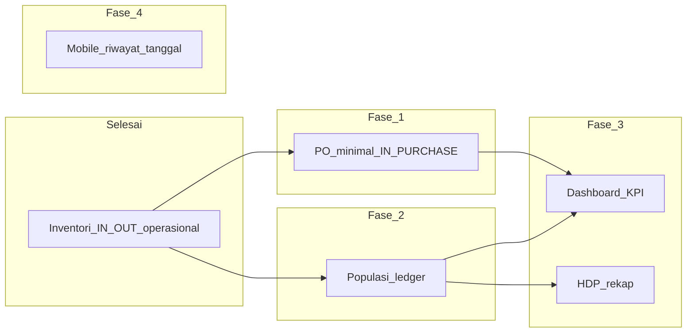

# Implementation Plan — AAPM Next Phase

**Living document** — checklist eksekusi agent untuk tahap pengerjaan setelah integrasi inventori (2–3 Juli 2026).

| | |
|--|--|
| **Terakhir diperbarui** | 2026-07-09 |
| **Baseline domain** | D1 ~95% · D2 ~70% · D3 ~75% · D4 ~5% |
| **Repo backend** | `layered-farm-agung` |
| **Repo mobile** | `aapm-mobile` (Fase 4) |

**Referensi:** [sitemap.md](./sitemap.md) · [weekly progress/02-07-2026.md](./weekly%20progress/02-07-2026.md) · [prisma/schema.prisma](../prisma/schema.prisma)

---

## Baseline — sudah selesai (jangan dikerjakan ulang)

- [x] Services inventori & stok (`apply-stock-mutation`, integrasi produksi/pakan/pengobatan)
- [x] Halaman `/dashboard/inventory` + detail item
- [x] **Penyesuaian stok** manual per lokasi (`IN_ADJUSTMENT` / `OUT_ADJUSTMENT`)
- [x] **Kartu stok** per item (riwayat mutasi di halaman detail)
- [x] Mobile: form input harian pakai item nyata dari `/api/v1/items`
- [x] Potong stok operasional: `OUT_FEED`, `OUT_MEDICAL`, `IN_HARVEST`
- [x] Input harian admin: grid status kandang + 4 tab rekap

---

## Diagram dependensi fase



**Urutan eksekusi:** Fase 1 → Fase 2 → Fase 3 → Fase 4 (Fase 4 bisa paralel setelah Fase 2).

**Scope PO:** minimal — buat PO + terima barang → `IN_PURCHASE`. Tanpa approval workflow kompleks.

---

## Fase 1 — Purchase Order minimal (Modul 7, D2)

**Tujuan:** Admin catat pembelian ke supplier; stok naik via `IN_PURCHASE`.

### Checklist

- [x] `features/procurement/schemas/purchase-order.ts` — Zod validasi
- [x] `features/procurement/services/create-purchase-order.ts`
- [x] `features/procurement/services/receive-purchase-order.ts` — `applyStockMutation` + `IN_PURCHASE`
- [x] `features/procurement/services/list-purchase-orders.ts`
- [x] `features/procurement/services/get-purchase-order.ts`
- [x] `features/procurement/actions/create-purchase-order.ts`
- [x] `features/procurement/actions/receive-purchase-order.ts`
- [x] `features/procurement/components/purchase-orders-management.tsx`
- [x] `features/procurement/components/purchase-order-detail-view.tsx`
- [x] `app/(dashboard)/dashboard/purchase-orders/page.tsx`
- [x] `app/(dashboard)/dashboard/purchase-orders/[poId]/page.tsx`
- [x] Nav item di `features/dashboard/config/navigation.ts` — permission `manage_inventory`
- [x] `features/procurement/schemas/purchase-order.test.ts`
- [x] Update `docs/sitemap.md`

### Schema (existing, tanpa migrasi)

- `PurchaseOrder`, `PurchaseOrderItem` — `prisma/schema.prisma`
- Status PO: `Pending` → `Received`

### DoD

- Admin buat PO (vendor + line items + lokasi penerimaan)
- Tombol "Terima barang" → stok bertambah; kartu stok menampilkan "Pembelian"
- `purchaseOrderCount` di daftar vendor > 0

### Out of scope

- Partial receive, edit/cancel PO, integrasi cashflow D4

---

## Fase 2 — Populasi ledger (D2+D3)

**Masalah:** `activeCyclePopulation` masih `initial_population` mentah; mutasi hanya log.

### Rumus (siklus aktif, sampai `asOfDate`)

```
current = initial_population + sum(Masuk) - sum(Mati) - sum(Afkir) - sum(Pindah)
```

### Checklist

- [x] `features/cages/lib/compute-cycle-population.ts`
- [x] `features/cages/lib/compute-cycle-population.test.ts`
- [x] Wire `get-cage-for-production.ts`, `list-field-cages.ts`
- [x] Validasi `record-population-mutation.ts` + `update-population-mutation.ts`
- [x] Update `docs/sitemap.md` jika perlu

### DoD

- API mobile return populasi aktif (bukan initial saja)
- Mati/Afkir/Pindah ditolak jika melebihi populasi aktif
- Unit test ledger lulus

### Backlog Fase 2b

- Mutasi `Pindah` antar kandang — butuh `target_cage_id` di schema (migrasi terpisah)

---

## Fase 3 — Dashboard KPI + HDP rekap (Modul 10 awal)

**Dependensi:** Fase 2 selesai (HDP butuh populasi benar).

### Checklist

- [x] `features/dashboard/services/get-dashboard-stats.ts`
- [x] Wire `features/dashboard/components/dashboard-overview.tsx`
- [x] `features/production/lib/compute-hdp.ts` + test
- [x] `features/cages/lib/cycle-age-weeks.ts`
- [x] Extend `list-daily-production-recap.ts` + `daily-production-recap-table.tsx` — kolom HDP %
- [x] Update `docs/sitemap.md`

### DoD

- `/dashboard` menampilkan produksi hari ini, populasi aktif, stok kritis, pengguna aktif
- Rekap telur admin punya kolom HDP %

### Out of scope

- Early warning push, FCR penuh, portal buyer

---

## Fase 4 — Mobile riwayat multi-tanggal (`aapm-mobile`)

### Checklist

- [x] `app/kandang/[id]/riwayat.tsx` — navigasi tanggal (prev/next + ke hari ini)
- [x] Update `aapm-mobile/docs/progress.md`

### DoD

- Staff bisa lihat riwayat kandang untuk tanggal selain hari ini

---

## Fase 5 — Backlog (jangan eksekusi dulu)

| Item | Catatan |
|------|---------|
| Halaman mutasi stok global | `/dashboard/inventory/mutations` |
| Offline sync + idempotency | Mobile queue + `clientMutationId` |
| Vaksinasi Modul 13 | `VaccineSchedule` + `OUT_VACCINE` |
| PO penuh | partial receive, edit, cancel |
| Mutasi Pindah lintas kandang | migrasi `target_cage_id` |
| D4 Sales & Cashflow | setelah operasional stabil |

---

## Konvensi eksekusi agent

1. Ikuti pola `features/vendors/` untuk CRUD admin baru
2. Stok selalu lewat `apply-stock-mutation.ts` dalam `$transaction`
3. Pesan error Bahasa Indonesia
4. Test Category A untuk stock math & populasi ledger (Bun, colocated `.test.ts`)
5. Update `sitemap.md` per fase (+ OpenAPI hanya jika endpoint mobile baru)
6. Jangan commit kecuali user minta

---

## Perkiraan dampak progress

| Setelah fase | D2 | D3 | Overall (13 modul) |
|--------------|----|----|---------------------|
| Fase 1 (PO) | ~80% | ~78% | ~48% |
| Fase 2 (populasi) | ~85% | ~82% | ~52% |
| Fase 3 (KPI+HDP) | ~85% | ~88% | ~55% |
| Fase 4 (mobile) | — | ~90% | ~56% |

*Perbarui tabel ini setelah tiap fase selesai.*
