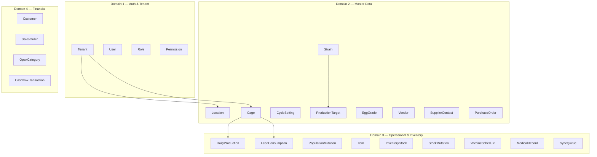

# Sitemap — Layered Farm Agung (AAPM)

**Living document** untuk melacak **rute aplikasi**, **target modul**, dan **progress implementasi**.  
Perbarui file ini setiap menambah/mengubah halaman atau menutup fase domain.

| | |
|--|--|
| **Terakhir diperbarui** | 2026-06-04 |
| **Schema DB** | [`prisma/schema.prisma`](../prisma/schema.prisma) |
| **Nav kode** | [`features/dashboard/config/navigation.ts`](../features/dashboard/config/navigation.ts) |
| **Proteksi rute** | [`proxy.ts`](../proxy.ts) |

---

## 1. Referensi bisnis (lokal, tidak di Git)

Dokumen di folder `docs/` (PDF/Excel) menjadi acuan ruang lingkup; **tidak** di-push ke repo (lihat [`docs/README.md`](./README.md)).

| Dokumen | Implikasi ke sitemap / modul |
|---------|------------------------------|
| **Guidance untuk strain Lohman** | `Strain`, `ProductionTarget` (HDP/FCR per umur), benchmarking produksi |
| **Program vaksinasi** | `VaccineSchedule`, `Item` (vaksin), modul kesehatan PWA/dashboard |
| **Proyek Pengembangan Sistem … PWA** | 13 modul README, offline sync, mobile input, executive dashboard |
| **Rekap Data Farm (sample)** | Contoh KPI harian, validasi form produksi & populasi |

---

## 2. Legenda status

| Status | Arti |
|--------|------|
| ✅ **Done** | Rute + alur utama jalan (CRUD atau form inti) |
| 🟡 **Partial** | Rute ada; fitur belum lengkap atau placeholder |
| 🔲 **Planned** | Belum ada rute; model/schema sudah atau akan ditambah |
| 🚫 **N/A** | Bukan halaman (API, asset, SW) |

**Progress domain (perkiraan):**

| Domain | Fokus | Progress |
|--------|--------|----------|
| **D1** Identity & tenant | Auth, RBAC, users, tenants | ~95% |
| **D2** Master data | Lokasi, kandang, strain, grade, vendor | ~60% |
| **D3** Operasional & PWA | Produksi, inventori, sync, kesehatan | ~25% |
| **D4** Finansial & laporan | Penjualan, cashflow, dashboard eksekutif | ~5% |

---

## 3. Peta domain ↔ model Prisma



---

## 4. Peran & akses rute

| Peran | Dashboard `/dashboard/*` | PWA lapangan `/kandang`, `/input-harian`, `/profil` |
|-------|--------------------------|-----------------------------------------------------|
| **superadmin** | ✅ (tenant switcher global) | ✅ (perlu tenant aktif untuk data) |
| **admin** | ✅ | ✅ |
| **staff** | 🚫 redirect → `/kandang` | ✅ |

| Permission | Cakupan |
|------------|---------|
| `view_dashboard` | Dashboard utama |
| `manage_users` | Pengguna |
| `manage_roles` | Tenant, peran, permission |
| `manage_master_data` | Lokasi, kandang, vendor (tenant) |
| `manage_global_catalog` | Strain, grade telur (superadmin) |
| `manage_production` | Produksi + seluruh PWA field |
| `manage_inventory` | Inventori (rencana) |
| `view_cashflow` | Keuangan (rencana) |

---

## 5. Sitemap lengkap

### 5.1 Publik & infrastruktur

| Path | Tipe | Status | Catatan |
|------|------|--------|---------|
| `/` | Redirect | ✅ | Staff → `/kandang`, lainnya → `/dashboard` |
| `/login` | Auth | ✅ | Username/email + password |
| `/~offline` | PWA | ✅ | Halaman offline Serwist |
| `/manifest.json` | PWA | ✅ | Web app manifest |
| `/serwist/*` | SW | 🚫 | Service worker (bukan halaman UI) |
| `/api/auth/*` | API | 🚫 | Better Auth |
| `/api/storage/*` | API | 🚫 | File storage |
| `/api/upload/logo` | API | 🚫 | Upload logo tenant |

### 5.2 PWA lapangan — `(field)` route group

Target: **Modul 4** (Front Office PWA), **Modul 5** (Offline Sync), input **Modul 6–8–13**.

| Path | Layar | Status | Model / fitur | Catatan |
|------|-------|--------|---------------|---------|
| `/kandang` | Dashboard lapangan | ✅ | `Cage`, `DailyProduction` | Progress harian, daftar kandang, status Selesai/Belum |
| `/input-harian` | Scan QR kandang | 🟡 | `Cage` | UI scan + pilih manual; kamera QR 🔲 |
| `/kandang/[cageId]/produksi` | Form produksi telur | ✅ | `DailyProduction`, `EggGrade` | Online submit; offline queue 🔲 |
| `/profil` | Profil & sync | 🟡 | `User`, `SyncQueue` | Info akun, tema, antrean sync stub |

**URL QR (produksi):** `/kandang/[cage_id]/produksi` — sesuai `DEV_NOTES.md`.

**Nav bawah:** Dashboard · Input Harian · Profil.

#### Rencana PWA (belum ada rute)

| Path (usulan) | Modul | Model | Status |
|---------------|-------|-------|--------|
| `/input-harian/pakan` | Pakan harian | `FeedConsumption`, `InventoryStock` | 🔲 |
| `/input-harian/mortalitas` | Mutasi populasi | `PopulationMutation`, `CycleSetting` | 🔲 |
| `/input-harian/vaksin` | Vaksinasi | `VaccineSchedule`, `Item` | 🔲 |
| `/input-harian/kesehatan` | Rekam medis | `MedicalRecord` | 🔲 |
| `/profil` (sync aktif) | Offline sync | `SyncQueue` | 🔲 flush + daftar pending |

### 5.3 Dashboard admin — `(dashboard)` route group

Target: **Modul 1–3**, **7–12** (back-office).

#### Utama

| Path | Menu | Status | Permission | Catatan |
|------|------|--------|------------|---------|
| `/dashboard` | Dashboard | 🟡 | `view_dashboard` | Shell ada; KPI eksekutif 🔲 |
| `/dashboard/production` | Produksi | 🟡 | `manage_production` | Link ke PWA; listing/rekap 🔲 |
| `/dashboard/inventory` | Inventori | 🟡 | `manage_inventory` | Coming soon |
| `/dashboard/finance` | Keuangan | 🟡 | `view_cashflow` | Coming soon |
| `/dashboard/profile` | Profil akun | ✅ | (session) | Ubah password |

#### Data master (tenant / global)

| Path | Menu | Status | Permission | Model |
|------|------|--------|------------|-------|
| `/dashboard/locations` | Lokasi | ✅ | `manage_master_data` | `Location` |
| `/dashboard/cages` | Kandang | ✅ | `manage_master_data` | `Cage`, `CycleSetting` (create) |
| `/dashboard/cages/[id]` | Detail kandang | 🟡 | `manage_master_data` | Siklus: edit/tutup/baru 🔲 |
| `/dashboard/strains` | Strain | ✅ | `manage_global_catalog` | `Strain` |
| `/dashboard/egg-grades` | Grade telur | ✅ | `manage_global_catalog` | `EggGrade` |
| `/dashboard/vendors` | Vendor | ✅ | `manage_master_data` | `Vendor` |

#### Administrasi

| Path | Menu | Status | Permission | Model |
|------|------|--------|------------|-------|
| `/dashboard/tenants` | Tenant | ✅ | `manage_roles` + global | `Tenant` |
| `/dashboard/users` | Pengguna | ✅ | `manage_users` | `User` |
| `/dashboard/roles` | Peran & akses | ✅ | `manage_roles` | `Role`, `Permission` |

#### Rencana dashboard (belum ada rute)

| Path (usulan) | Modul README | Model utama | Status |
|---------------|--------------|-------------|--------|
| `/dashboard/production-targets` | Strain & standardisasi | `ProductionTarget` | 🔲 |
| `/dashboard/cages/[id]/cycles` | Siklus produksi | `CycleSetting` | 🔲 |
| `/dashboard/items` | Inventori | `Item` | 🔲 |
| `/dashboard/inventory/stocks` | Stok per lokasi | `InventoryStock` | 🔲 |
| `/dashboard/inventory/mutations` | Mutasi stok | `StockMutation` | 🔲 |
| `/dashboard/vendors/[id]/contacts` | Procurement | `SupplierContact` | 🔲 |
| `/dashboard/purchase-orders` | PO | `PurchaseOrder`, `PurchaseOrderItem` | 🔲 |
| `/dashboard/population` | Mutasi populasi | `PopulationMutation` | 🔲 |
| `/dashboard/health/vaccines` | Vaksinasi | `VaccineSchedule` | 🔲 |
| `/dashboard/health/records` | Kesehatan | `MedicalRecord` | 🔲 |
| `/dashboard/sales` | Penjualan | `SalesOrder`, `Customer` | 🔲 |
| `/dashboard/cashflow` | Cashflow | `CashflowTransaction`, `OpexCategory` | 🔲 |
| `/dashboard/alerts` | Early warning | (agregasi D3) | 🔲 |
| `/dashboard/reports` | Laporan HDP/FCR | `ProductionTarget` + agregasi | 🔲 |

---

## 6. Target modul (README) vs progress

Mapping **13 modul produk** (`README.md`) ke implementasi saat ini.

| # | Modul | Halaman kunci | Status | Gap utama |
|---|--------|---------------|--------|-----------|
| 1 | User management | `/dashboard/users`, `/dashboard/roles`, `/dashboard/tenants` | ✅ | Audit log 🔲 |
| 2 | Master data peternakan | `/dashboard/locations`, `/dashboard/cages` | 🟡 | Delete kandang 🔲, siklus penuh 🔲 |
| 3 | Strain & standardisasi | `/dashboard/strains`, `ProductionTarget` | 🟡 | CRUD target HDP/FCR 🔲 |
| 4 | Front Office PWA | `/kandang`, `/input-harian`, `/profil` | 🟡 | QR kamera, form pakan/mortalitas 🔲 |
| 5 | Offline sync | `/profil` (antrean) | 🔲 | IndexedDB + flush `SyncQueue` |
| 6 | Mutasi populasi | — | 🔲 | PWA + dashboard |
| 7 | Vendor & procurement | `/dashboard/vendors` | 🟡 | Kontak, PO 🔲 |
| 8 | Inventory control | `/dashboard/inventory` | 🔲 | Item, stok, mutasi |
| 9 | Early warning | — | 🔲 | Rules + notifikasi |
| 10 | Executive dashboard | `/dashboard` | 🔲 | KPI, HDP/FCR, chart |
| 11 | Sales recording | — | 🔲 | `SalesOrder` |
| 12 | Cashflow ledger | `/dashboard/finance` | 🔲 | `CashflowTransaction` |
| 13 | Health / vaccination | — | 🔲 | `VaccineSchedule`, `MedicalRecord` |

---

## 7. Backlog per fase (disarankan)

### Fase A — Domain 3 inti (sedang berjalan)

- [x] Produksi telur online (`DailyProduction`)
- [x] PWA shell + dashboard kandang + profil
- [ ] Kamera QR nyata di `/input-harian`
- [ ] Offline queue → `SyncQueue`
- [ ] Dashboard produksi: tabel rekap harian

### Fase B — Master data & siklus

- [ ] Manajemen `CycleSetting` (tutup/buka siklus)
- [ ] `ProductionTarget` per strain (acuan PDF Lohmann)
- [ ] Delete UI kandang/vendor (aturan bisnis)

### Fase C — Inventori & pakan

- [ ] CRUD `Item`, `InventoryStock`
- [ ] Form PWA `FeedConsumption` + alert stok minimum

### Fase D — Kesehatan & populasi

- [ ] `PopulationMutation` + update populasi siklus
- [ ] `VaccineSchedule` (acuan Program vaksinasi PDF)
- [ ] `MedicalRecord`

### Fase E — Finansial & insight

- [ ] `PurchaseOrder` + link cashflow
- [ ] `SalesOrder` / `Customer`
- [ ] Dashboard eksekutif + early warning

---

## 8. Konvensi menambah entri baru

Saat membuat halaman:

1. Tambah baris di tabel **§5** dengan path, status, permission, model.
2. Update **§6** jika modul README terdampak.
3. Centang / tambah item di **§7** backlog.
4. Update `features/dashboard/config/navigation.ts` jika masuk menu dashboard.
5. Untuk PWA field, pertimbangkan tab di `FieldShell` / nav bawah.

**Penamaan rute:** kebab-case, Bahasa Indonesia untuk label UI, path singkat (`/dashboard/cages`, `/kandang/[id]/produksi`).

---

## 9. Ringkasan rute terbangun (quick reference)

```
/                          → redirect by role
/login
/~offline

/kandang                   ✅ PWA home
/input-harian              🟡 QR scan
/kandang/[id]/produksi     ✅ Form produksi
/profil                    🟡 Profil + tema

/dashboard                 🟡
/dashboard/production      🟡
/dashboard/inventory       🟡 placeholder
/dashboard/finance         🟡 placeholder
/dashboard/profile         ✅
/dashboard/locations       ✅
/dashboard/cages           ✅
/dashboard/cages/[id]      🟡
/dashboard/strains         ✅
/dashboard/egg-grades      ✅
/dashboard/vendors         ✅
/dashboard/tenants         ✅
/dashboard/users           ✅
/dashboard/roles           ✅
```

---

*Dokumen ini melengkapi `AGENTS.md` dan `DESIGN.md`; untuk aturan validasi form lapangan lihat `DEV_NOTES.md`.*
